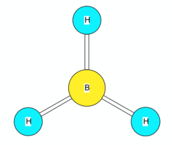
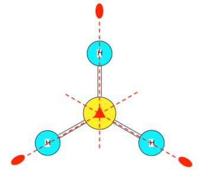

- Common examples of symmetry exist in nature, art, and architecture.
	- [[Chemistry/Inorganic Chemistry/Symmetry and Group Points/Symmetry in Flowers |Symmetry in Flowers]]

- Molecules exhibit symmetry.
 
### Examples of Symmetrical and Non-Symmetrical Molecules

![[Chemistry/Inorganic Chemistry/Symmetry and Group Points/images/Symmetry and Group Points.png]]

![[Chemistry/Inorganic Chemistry/Symmetry and Group Points/images/Symmetry and Group Points 2.png]]

### Roadmap to Molecular Orbitals

#### 0. Atomic Orbitals

#### 1. Molecular Geometry

- To understand molecular orbitals and why molecules will form bonds, start by identifying the shape of a molecule using VSEPR theory.

- In VSEPR theory, a molecule can be arranged into one of many shapes based on the configuration that bonded and unbonded electrons form around an atom.

#### 2. VSEPR Theory

-  The <u>Valence-Shell Electron-Pair Repulsion</u> model (pronounced "vesper") can be used to predict the shapes of molecules.

-  Electrons are found in <u>electron orbitals</u> when bound to an atom.
-  Orbitals have <u>electron affinity</u>, and attract electrons.

-  Orbitals are found in <u>orbital shells</u>, which come in four flavors: s, p, d, and f.

![[Chemistry/VSEPR Theory/Orbital Shells]]

- Electrons enter orbitals according to a set of rules, where the lowest energy oribitals are consumed first.

![[Chemistry/VSEPR Theory/Orbital Precedence]]

-  Non-bonded electrons have more energy than bonded electrons, and will experience an "axial/equatorial effect".
-  The <u>axial/equatorial effect</u> occurs when non-bonded electrons move to equitorial positions to obtain the most space.
    
![[Chemistry/VSEPR Theory/VSEPR Theory]]

#### 3. Symmetry Analysis

- A <u>symmetry operation</u> is a way of changing the orientation of a molecule so that it looks exactly the same as before.

| Symbol        | Operation Name     | Symmetry Element                 | Description                                            |
| ------------- | ------------------ | -------------------------------- | ------------------------------------------------------ |
| E             | Identity           | "Whole of space"                 | No observable change                                   |
| Cn | Rotation by 360°/n | n-fold symmetry axis             | Rotates by 360°/n                                      |
| σ             | Reflection         | mirror plane                     | Reflects across a plane                                |
| *i*           | Inversion          | center of inversion              |                                                        |
| Sn | Improper Rotation  | n-fold axis of improper rotation | Rotates by 360°/n followed by perpendicular reflection |
 
- A <u>symmetry element</u> is a geometric feature, such as a point, line, or plane, around which a symmetry operation is performed.
- A <u>point group</u> defines a set of symmetry operations that leave the molecule in the same spacial orientation.

	

		
	

	

		<h4 style="padding-left: 20px;">Borane:</h4>
		<ul>
			<li />trigonal planar molecular geometry
			<li />two rotational axes
			<li />D3h point group
		</ul>
	

	

		
	

	
	
		<h4 style="padding-left: 20px;">Symmetry Diagram</h4>
		<ul>
			<li />the triangle labels the C3 axis
			<li />the ovals label the three C2 axes
			<li />the highest rotation axis (principal axis)
		</ul>
	

