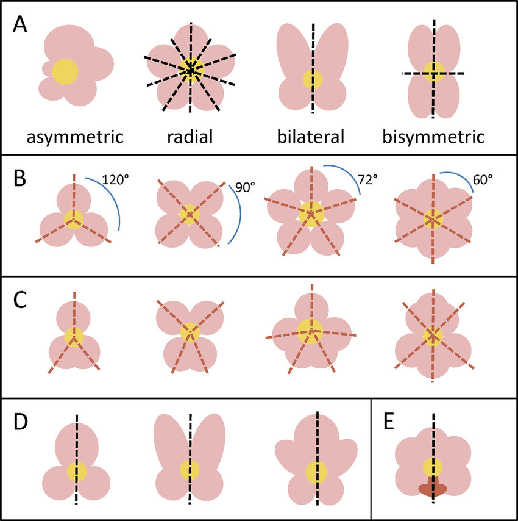

	

[[Chemistry/Inorganic Chemistry/Symmetry and Group Points/Credits#^003a51|Credit: Re“CYC”ling Molecular Regulators In The Evolution And Development Of Flower Symmetry]]

A. Types of flower symmetry
-   Asymmetrical flowers have no plane of symmetry.
-   Radial flowers have multiple planes of symmetry.
-   Bilateral flowers have one plane of symmetry.
-   Bisymmetrical flowers have two planes of symmetry perpendicular to each other.

B. Symmetry types determined by petal number and angles

-   Equally-sized petals can create radial symmetry with equally spaced petals.

C. Deviations from the standard petal angles generate bilateral flowers.

D. Bilateral symmetry can be created by unequally-sized petals.

E. Modified petals can also create bilateral symmetry in flowers.